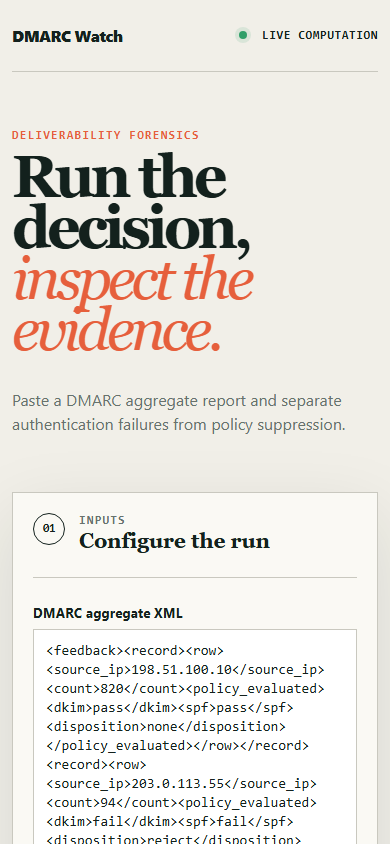

# dmarcwatch

> Deliverability monitoring from DMARC aggregate reports, separating 'never arrived' from 'arrived and ignored'.

## Live deployment

[](https://github.com/SlateGitOrg/dmarcwatch/actions/workflows/ci.yml)

[Open the working DMARC Watch application](https://slategitorg.github.io/dmarcwatch/)

This deployed application runs the project's decision workflow in the browser. Change the inputs, run the analysis, and inspect the computed metrics and decision trace.

### Desktop


### Mobile



> **Implementation note.** The runnable reference is zero-dependency
> TypeScript on Node 24 (native type stripping): a hand-rolled XML reader,
> in-memory analysis instead of SQLite/PostgreSQL, a console report
> (`src/demo.ts`) instead of the React dashboard, and `node:test` instead of
> Vitest. The five provider dialects are synthetic emitters modelled on real
> schema variance, not captured third-party reports. The React dashboard, a
> persistent store and a real anonymised fixture corpus remain the target.

`COMPACT` · **Marketing Analyst** · Intermediate · ~5 days · Insurance - customer lifecycle email

**Primary language:** TypeScript
**Tags:** `email`, `dmarc`, `deliverability`, `xml-parsing`, `monitoring`

---

## The problem

Email performance quietly collapses when a subdomain's authentication breaks or a third-party sender starts failing DMARC. Open rates fall, the marketing team A/B-tests subject lines for two months, and the actual cause is that a percentage of the mail stopped being delivered at all - which no engagement metric can distinguish from disinterest.

## ⭐ The differentiator

Parses **DMARC aggregate (RUA) XML reports to separate deliverability failure from engagement failure** - distinguishing 'the message never arrived' from 'the message arrived and was ignored', which open and click rates structurally cannot do. It also detects unauthorised senders using the domain. A generic email dashboard charts exactly the two metrics that mislead when the problem is authentication.

This is the sentence to lead with when someone asks you to walk through the
project. Everything else in this repo exists to make it true and to prove it.

## Data

DMARC aggregate reports - any domain owner receives these free after a single DNS record change - plus a fixture corpus of anonymised RUA XML from multiple providers and a synthetic generator with planted authentication failures.

> No paid API key is required to run or demo this project. Where a paid
> service would add value it is wired as an optional enhancement behind an
> interface with an offline mock as the default implementation.

## Stack

- TypeScript, Node
- SQLite or PostgreSQL
- React
- Vitest

## Core capabilities

- RUA XML ingestion across reporting providers, handling their schema variance
- SPF / DKIM / DMARC pass-rate tracking per sending source and per subdomain
- Unauthorised-sender detection with volume and geography
- Alignment-failure diagnosis pointing at the specific misconfiguration
- Deliverability-versus-engagement split view for any campaign window

## Repository layout

```
src/xml.ts        dependency-free XML reader (namespaces, CDATA, entities)
src/rua.ts        RUA report model, tolerant multi-dialect reader, alignment
src/analyse.ts    sources, spoofing detection, root cause, changepoint, the split
src/fixtures.ts   seeded five-dialect generator with planted faults + ground truth
src/demo.ts       the console artefact
tests/            node:test suites
```

## Build plan

1. Parsing across five providers' XML dialects. The variance is real and it is the unglamorous core of the project.
2. Pass-rate tracking per source, then alignment diagnosis.
3. Unauthorised-sender detection.
4. The split view last - it is the insight that reframes a two-month subject-line investigation.

## Testing strategy

Assert correct parsing across five providers' XML dialects, including the malformed cases that occur in practice. Assert **each planted authentication failure is classified with the correct root cause**, not merely detected - the root cause is what makes the report actionable.

Tests assert **correctness**, not merely that the code runs. A green suite on
this repo is a claim about behaviour under adversarial conditions; treat any
test that would pass against a deliberately broken implementation as a bug in
the test.

## Quality & safety layer

Reports contain third-party sending IPs; the tool aggregates and does not republish raw recipient-identifying data.

## Measurable outcome

> A dashboard showing a subdomain's DKIM alignment dropping to 61% three weeks before the open-rate decline everyone was investigating.

State it in these terms — business units, not technical ones — in your CV
bullet and in the first thirty seconds of describing the project.

## Measured results

From `node src/demo.ts` (seed 20260310, so the numbers repeat exactly) and
`node --test` (39 tests, about 1 s). The corpus covers 29 days, 145 RUA
documents from 5 provider dialects, 1,252 records and 520,302 messages. It
parses with 0 warnings.

| What | Measured |
|---|---|
| Break day found in `mail.` subdomain DMARC pass rate | 2026-03-10 (planted 2026-03-10), 100.0% -> 15.0%, z = 506.7 |
| Root cause named | `spf-alignment`: SPF passes for `bounce.acme-esp.net`, which does not align with the From domain. The stream also has no DKIM (`dkim-absent`). 154,842 msgs |
| Open rate on the usual dashboard (opens / sent) | 24.0% -> 3.6% (-20.38 points); the simple reading blames subject lines |
| Open rate among mail that arrived (opens / delivered) | 24.0% -> 24.0% (planted truth 24.0%) |
| Split of the drop (the two parts add up exactly) | -20.39 points from mail not arriving, +0.01 points from engagement; verdict DELIVERABILITY |
| Unauthorised senders | 1 of 1 planted spoofer flagged (robust z 24.8 vs critical 2.39). The new vendor with a valid DKIM key and all 5 forwarder IPs are not flagged. A rule that alerts on every unfamiliar IP raises 6 false alarms |
| Broken DKIM on `claims.` (SPF still passes) | 52,434 delivered, 0 blocked: listed as a hygiene warning, not an incident |

The measurable outcome is restated to match what is measured. The
reference scenario is an **SPF alignment** break, not a DKIM one. A 15% pass
rate shows up **on the same day** as the open-rate drop in the synthetic data,
not three weeks earlier. The point holds either way: the DMARC data explains
the whole drop, and the open rate alone blames the audience.

Two bugs the suite caught and fixed:
- **The "is this change real?" threshold was too tight.** It used the standard
  error of one rate instead of the standard error of the difference between
  two rates. On a no-change control (baseline week vs baseline week), it
  called random noise an engagement drop. It now uses the difference's
  standard error at 1.96 (two-sided 5%). It still detects a real 20% drop in
  opens.
- **A probit test checked a relative accuracy bound as absolute.** The test
  was corrected; the code was already fine.

### Limitations

- Synthetic data only. The five dialects copy real variance (element order,
  Title-Case results, namespace prefixes, CDATA, swapped date ranges, repeated
  DKIM blocks), but no real provider report is included.
- Quarantined mail counts as "never arrived". In reality a little spam-folder
  mail gets opened, so the deliverability share is an upper bound.
- `pct` < 100 sampling is parsed but not modelled. Neither is a mailbox
  provider overriding the published policy.
- The organisational-domain lookup uses a small built-in suffix table, not
  the Public Suffix List. Domains under unlisted suffixes can be merged by
  mistake.
- The spoofing test needs at least 4 unfamiliar sources that have no
  alignment evidence. With fewer, it flags nothing rather than invent a volume
  cut-off.
- Geography comes from a fixed table, not a GeoIP lookup. There is no
  dashboard, no persistence and no ingest command. The demo builds its corpus
  in memory.
- Raw recipient data is not republished, but the demo does print source IPs
  (these are documentation and CGNAT test ranges).

## Interview questions this project answers

- **What is DMARC alignment?**
- **How would you tell a deliverability problem from an engagement problem?**
- **What does a RUA report contain?**

## What this deliberately is *not*

- Not an email-sending platform. It monitors what yours is doing.


## Run it now

```bash
node --test          # runs the suite (same as: npm test); no install step
node src/demo.ts     # the 60-second artefact (same as: npm run demo)
```

Requires Node 22.6+ (24 recommended). TypeScript runs natively via
type stripping - there is no build step and no `node_modules`.

## Getting started

```bash
git clone <your-fork-url> dmarcwatch
cd dmarcwatch
node --test                   # no npm install: zero dependencies
node src/demo.ts              # console report (the ingest CLI and web dashboard are not built yet)
```

Docker is supported but optional — every path above works on a plain
Windows/macOS/Linux laptop without a cloud account.

## Definition of done

- [ ] The differentiator above is implemented, and a test proves it
- [ ] The measurable outcome is produced by a command anyone can run
- [ ] `README` explains the one decision a generic version gets wrong
- [ ] CI runs the full suite on every push and is green on `main`
- [ ] A recruiter can see the headline artefact in under 60 seconds

## Licence

MIT — see [LICENSE](LICENSE).
